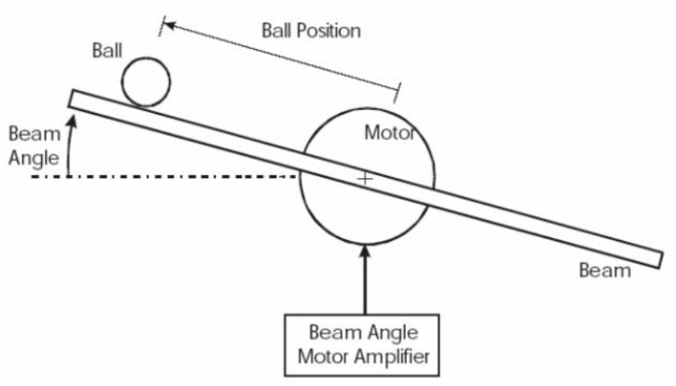
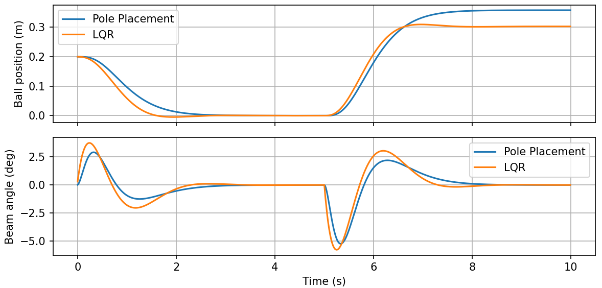

# Ball and Beam Simulation

This repository contains a simulation of the classic **Ball and Beam system**, a widely used benchmark in control system studies. The system models a ball rolling on a beam, where the beam's angle is controlled to achieve a desired ball position.

  

## Features

- Simulated using **nonlinear dynamics** based on physical equations.
- Implemented in **Python** using:
  - `numpy` for numerical operations,
  - `matplotlib` for visualization.
- Includes two state-feedback control strategies:
  - **Pole Placement**
  - **Linear Quadratic Regulator (LQR)**

## Objective

The goal of the simulation is to **control the position of the ball** so that it stays at a specific distance from the center of the beam (setpoint tracking). The beam angle is the only control input, adjusted using feedback from the full system state.

## Model Overview

The nonlinear dynamics of the system are derived from physics, involving:
- Translational motion of the ball,
- Rotational dynamics of the beam,
- Gravity and coupling effects.

The system states are:
- \( x_0 \): Ball position on the beam  
- \( x_1 \): Ball velocity  
- \( x_2 \): Beam angle (radians)  
- \( x_3 \): Beam angular velocity

## How To Run
Run the `main` script.

  

## 📊 Simulation Results

The simulation produces plots comparing ball position and beam angle over time under both control strategies. These help visualize tracking performance and control response.

### Example Outputs:
- **Ball Position vs Time**
- **Beam Angle vs Time**

